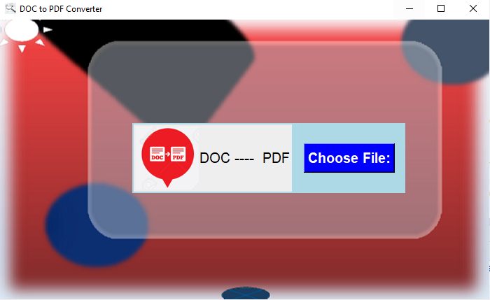
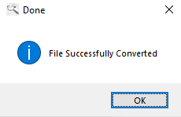

# DOC/DOCX to PDF Converter

This is Official Repository for our participation in WhoDoneItHacks 2020.

# Requirements :
You Must have Python 3.7 or lower installed on your System.

also you must have Tkinter Library and PIL Library.

#Screenshots

